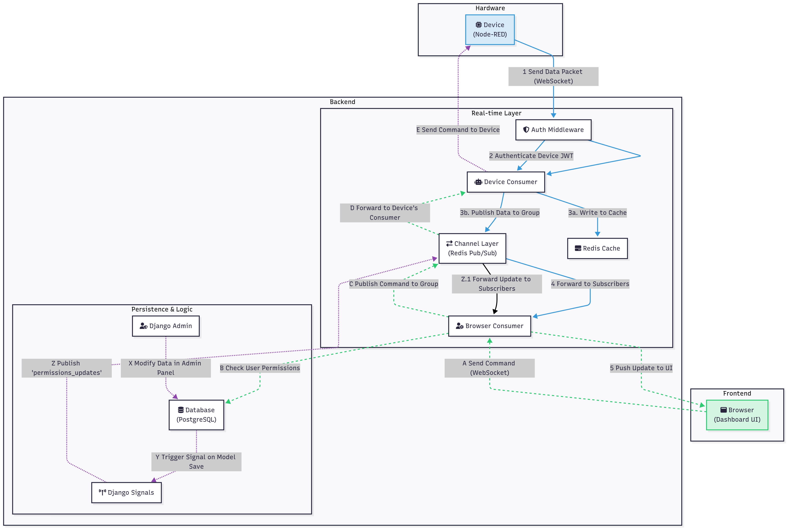
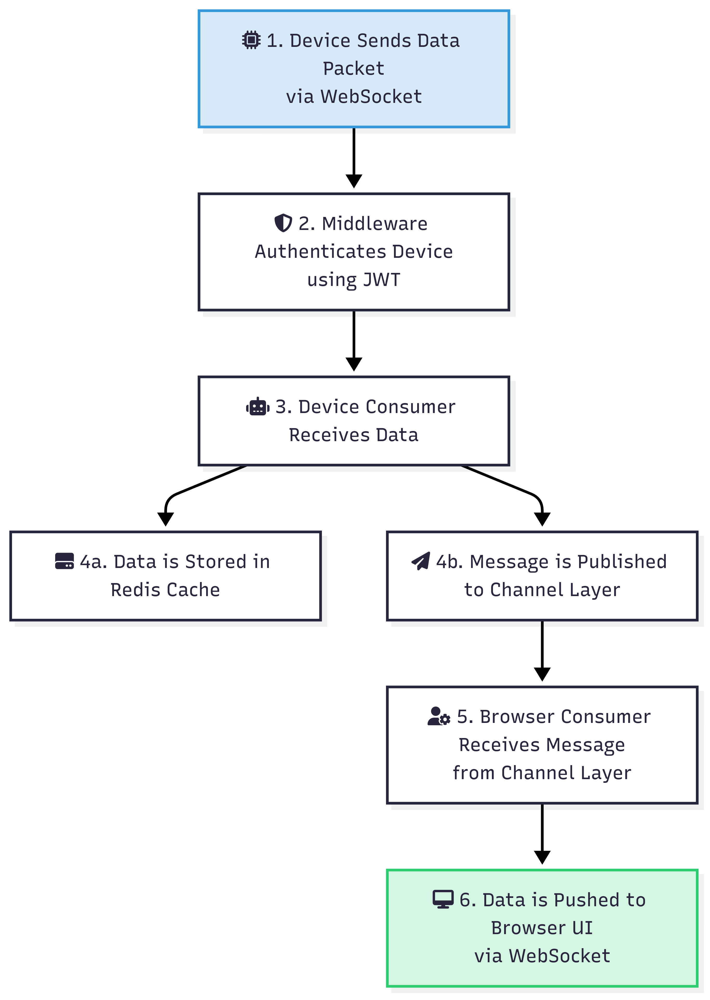
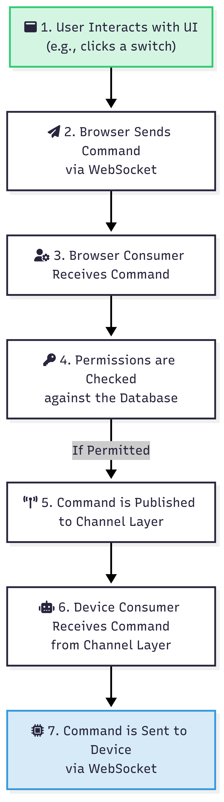

# 2. System Architecture

Quack Quack is built upon a modern, event-driven architecture designed for scalability, security, and real-time responsiveness. This section provides a high-level overview of the core components and illustrates the primary data flow patterns.

## High-Level Overview

At its core, the system functions as a central hub that facilitates communication between two main types of clients: **Devices** (data producers/actuators) and **Browsers** (data consumers/controllers). The communication is managed by a Django backend, supercharged with Django Channels, using Redis as a high-speed message broker and cache.

This decoupled design means that backend components, devices, and user interfaces can be scaled and updated independently of each other.

### Core Components

- **Nginx (Reverse Proxy):** The entry point for all network traffic. It routes standard HTTP requests to the Django application server (Gunicorn) and upgrades WebSocket connections to be handled by the ASGI server (Daphne).
- **Daphne (ASGI Server):** The asynchronous server that manages all persistent WebSocket connections. It is responsible for handling the real-time, bidirectional communication with both devices and browsers.
- **Gunicorn (WSGI Server):** The synchronous server that handles traditional HTTP requests, such as serving the Django Admin panel and other web pages.
- **Django & Channels Consumers:** The heart of the application logic.
    - **Device Consumer (`NodeRedConsumer`):** Authenticates devices via JWT, ingests incoming data, caches it, and publishes it to the appropriate channels.
    - **Browser Consumer (`BrowserConsumer`):** Manages user sessions, handles subscriptions to data elements, enforces permissions, and pushes real-time updates to the UI.
- **Redis:** Serves two critical roles:
    1.  **Message Broker:** Powers the Django Channels layer, enabling consumers to broadcast and receive messages across different groups (Pub/Sub).
    2.  **Cache:** Stores the most recent data points for each element, allowing new clients to be populated with historical data immediately upon subscription.
- **PostgreSQL:** The primary database for storing all persistent data, including device configurations, user accounts, and permission rules.

## Primary Data Flows

There are two primary data flow patterns in the system, each illustrating a key use case.

### Flow 1: Device to Browser (Data Monitoring)

This flow describes how sensor data travels from a physical device to a user's dashboard for real-time monitoring.

**Steps:**
1.  A **Device** sends a data packet (e.g., a temperature reading) over its WebSocket connection.
2.  The **Middleware** authenticates the device using its JWT.
3.  The **Device Consumer** receives the data.
4.  The consumer simultaneously **(4a)** stores the data in the **Redis Cache** and **(4b)** publishes a message to the relevant **Channel Layer** group.
5.  The **Browser Consumer**, subscribed to that group, receives the message.
6.  The consumer forwards the data to the **Browser** over its WebSocket connection, where the UI is updated instantly.

### Flow 2: Browser to Device (Remote Control)

This flow describes how a user's action on the dashboard (e.g., flipping a switch) sends a command to a physical device.

**Steps:**
1.  A **User** interacts with a control element on the dashboard.
2.  The **Browser** sends a command message over its WebSocket connection.
3.  The **Browser Consumer** receives the command.
4.  It first **checks the user's permissions** against the database to ensure they are authorized to perform this action.
5.  If permitted, the consumer publishes the command to the relevant **Channel Layer** group.
6.  The **Device Consumer**, also subscribed to that group, receives the command.
7.  The consumer forwards the command to the target **Device** over its WebSocket connection, triggering the physical action.