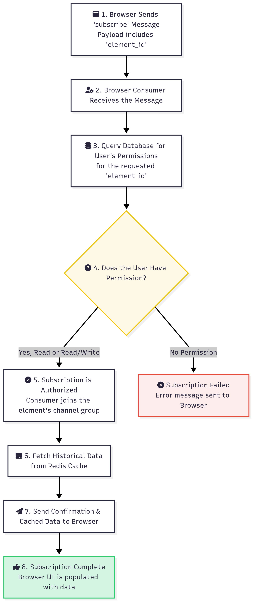

# Browser WebSocket API

This document provides a detailed reference for the WebSocket API used by browser-based clients to interact with the Quack Quack platform.

## Connection

- **Endpoint:** `ws://<your_domain>/browser/simple/`
- **Authentication:** Requires an active Django user session. The WebSocket connection will automatically inherit the user's authentication state from the browser's session cookies. Anonymous users will be rejected.

## Message Format

All messages sent and received are in JSON format. The primary field is `type`, which determines the action or event.

---

## Messages Sent by the Client (Browser -> Server)

These are the messages your frontend application will send to the server.

### 1. `subscribe`

Subscribes the client to real-time updates for a specific data element. This is the first message that should be sent after establishing a connection for each element you want to monitor.

- **`type`**: `"subscribe"`
- **Payload**:
  - `element_id` (string, required): The UUID of the element to subscribe to.

**Example:**
```json
{
  "type": "subscribe",
  "element_id": "98994c94-71b8-53b0-85f3-d1c6483978de"
}
```

### 2. `unsubscribe`

Unsubscribes the client from an element's updates.

- **`type`**: `"unsubscribe"`
- **Payload**:
  - `element_id` (string, required): The UUID of the element to unsubscribe from.

**Example:**
```json
{
  "type": "unsubscribe",
  "element_id": "98994c94-71b8-53b0-85f3-d1c6483978de"
}
```

### 3. `message_element`

Sends a message or command from the browser to a device, via the server. This is used for control elements like switches and sliders. This action will fail if the user does not have `Read/Write` (`RC`) permissions for the element.

- **`type`**: `"message_element"`
- **Payload**:
  - `element_id` (string, required): The UUID of the target element.
  - `message` (object, required): The data payload to be sent. The structure of this object depends on the element type (e.g., `{ "value": 1 }` for a switch).

**Example (for a switch):**
```json
{
  "type": "message_element",
  "element_id": "e5b1cb93-114e-5609-9dcf-2b7360375e5a",
  "message": {
    "value": 1
  }
}
```

---

## Messages Received by the Client (Server -> Browser)

These are the messages your frontend application will receive from the server.

### 1. Subscription Confirmation (`subscribe`)

The server's response to a successful `subscribe` request. It confirms the subscription and provides initial state information about the element.



- **`type`**: `"subscribe"`
- **Payload**:
  - `element_id` (string): The UUID of the element.
  - `subscribed` (boolean): `true` on success.
  - `permissions` (string): The user's permission level (`"R"` or `"RC"`).
  - `details` (object): The configuration details for the element (e.g., chart type, gauge limits).
  - `connected` (boolean): The current connection status of the element's parent device.

**Example:**
```json
{
  "type": "subscribe",
  "element_id": "98994c94-71b8-53b0-85f3-d1c6483978de",
  "subscribed": true,
  "permissions": "RC",
  "details": { "title": "Main Gauge", "minValue": 0, "maxValue": 100 },
  "connected": true
}
```

### 2. Element Update (`message_element`)

A real-time data update for a subscribed element. This is the most common message type received.

- **`type`**: `"message_element"`
- **Payload**:
  - `element_id` (string): The UUID of the element this message is for.
  - `message` (object): The data payload (e.g., `{ "value": 42.5 }`).
  - `auth` (object): Information about who sent the message.
    - `user_id` (string | number): The ID of the user or device.
    - `username` (string): The name of the user or device.
  - `last_edit_at` (string): ISO 8601 timestamp of when the message was sent.

**Example (for a gauge):**
```json
{
  "type": "message_element",
  "element_id": "98994c94-71b8-53b0-85f3-d1c6483978de",
  "message": {
    "value": 75.3
  },
  "auth": {
    "user_id": "device-uuid-123",
    "username": "Main Sensor Rig"
  },
  "last_edit_at": "2024-05-21T10:30:00.123Z"
}
```

### 3. Historical Data (`message_element_history`)

After a successful subscription, the server sends a batch of recent data points from the cache. These messages have the same structure as `message_element`.

### 4. Permissions Update (`permissions_updates`)

Sent by the server in real-time if a user's permissions for an element are changed by an administrator.

- **`type`**: `"permissions_update"`
- **Payload**:
  - `element_id` (string): The UUID of the affected element.
  - `permissions` (string): The new permission level (`"R"`, `"RC"`, or `null`).

### 5. Connection Status (`element_connection_status`)

Sent by the server in real-time when the parent device of a subscribed element connects or disconnects.

- **`type`**: `"element_connection_status"`
- **Payload**:
  - `element_id` (string): The UUID of the affected element.
  - `status` (string): `"connected"` or `"disconnected"`.

### 6. Error (`error`)

Sent by the server if an action fails (e.g., subscribing to a non-existent element or sending a command without permission).

- **`type`**: `"error"`
- **Payload**:
  - `error_code` (string): A machine-readable error code (e.g., `"permission_denied"`).
  - `description` (string): A human-readable description of the error.
  - `element_id` (string, optional): The element related to the error.
