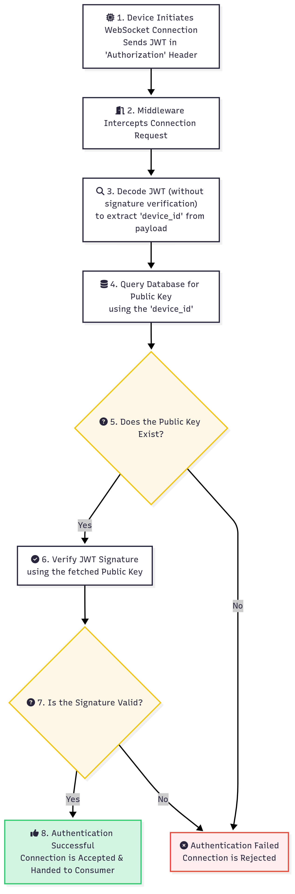
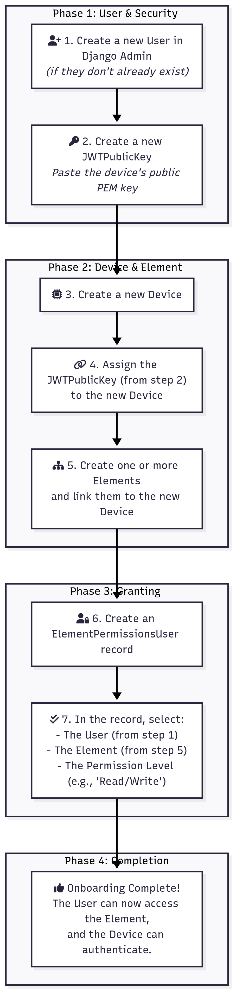
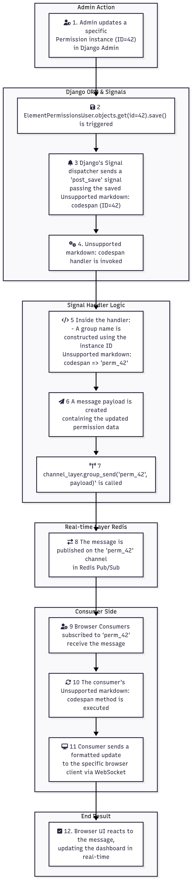

# 5. Core Concepts

While the [System Architecture](./../02_architecture.md) section describes the "what" of the system, this section focuses on the "how". Understanding these core concepts is essential for developers and administrators who want to leverage the full power of Quack Quack, customize its behavior, or troubleshoot issues.

These concepts represent the fundamental design decisions that make the platform secure, responsive, and robust.

## Key Concepts Covered

This section is divided into the following key areas:

- **[Device Authentication](./authentication.md):**
  A deep dive into the secure JWT-based authentication flow that ensures only trusted hardware can connect to the platform. This is the first line of defense for your IoT system.
  
  

- **[Permissions & Onboarding](./permissions.md):**
  An explanation of the Role-Based Access Control (RBAC) model used to manage user access to data elements. This section also includes a step-by-step guide for onboarding new devices and users.

  

- **[Reactivity with Django Signals](./reactivity_signals.md):**
  A look under the hood at how Quack Quack achieves real-time state synchronization. This concept explains how changes in the database are instantly propagated to all connected clients without manual intervention.

  

---

Each of these concepts is crucial for building a secure and reliable IoT application. We recommend reading through them to gain a comprehensive understanding of how Quack Quack operates.
