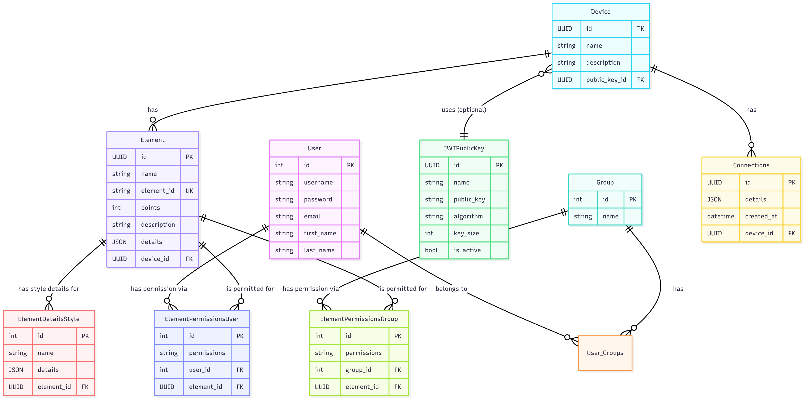

# 6. Database Schema

The Quack Quack database is designed to be both robust and flexible, providing a solid foundation for the platform's features. This section provides a visual overview of the database schema and a description of the key tables.

The schema is managed via Django's Object-Relational Mapper (ORM), with migrations tracking all historical changes. The primary database used is PostgreSQL.

## Entity-Relationship Diagram (ERD)

The following diagram illustrates the main tables in the database and the relationships between them.

## Key Table Descriptions

Below is a brief description of the primary models and their roles within the system.

### Core Models

- **`Device`**: Represents a physical device or a programmatic client. Each device has a unique ID and is linked to a public key for authentication.
  - `public_key`: A foreign key to the `JWTPublicKey` table. This is the cryptographic identity of the device.

- **`Element`**: Represents a single data point or control widget associated with a `Device`. This is the core "resource" that users interact with.
  - `device`: A foreign key linking the element to its parent device.

- **`Connections`**: A log table that stores records of active WebSocket connections from devices. It is used to determine the online/offline status of a device.
  - `device`: A foreign key linking a connection record to the device that made it.

- **`JWTPublicKey`**: Stores the public keys used to authenticate devices. Keeping keys in a separate table allows for key rotation and re-use.

### User & Permissions Models

- **`User`** & **`Group`**: Standard Django models for managing user accounts and roles (groups).

- **`ElementPermissionsUser`**: A junction table that maps a `User` directly to an `Element` with a specific permission level (`R` or `RC`). This allows for user-specific permission overrides.
  - `user`: Foreign key to the `User` table.
  - `element`: Foreign key to the `Element` table.

- **`ElementPermissionsGroup`**: A junction table that maps a `Group` (role) to an `Element` with a specific permission level. This is the primary mechanism for implementing Role-Based Access Control (RBAC).
  - `group`: Foreign key to the `Group` table.
  - `element`: Foreign key to the `Element` table.

### Frontend Configuration Models

- **`ElementDetailsStyle`**: A flexible model used to store JSON-based configuration details for frontend components. This allows the appearance and behavior of a widget (like a gauge's limits or a chart's color) to be defined in the database.
  - `element`: A foreign key linking the style configuration to a specific element.

This schema is designed to be highly normalized, ensuring data integrity and providing the flexibility needed to support the platform's granular permission system and dynamic frontend.