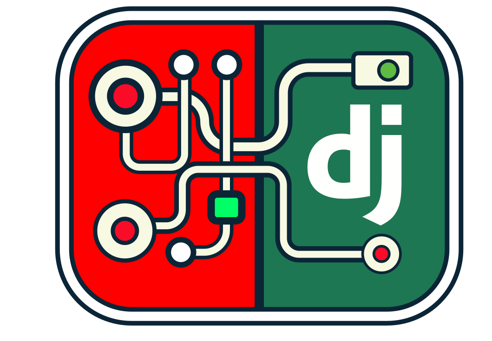
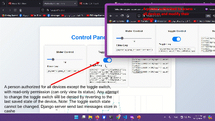

.gif>)

### **Node-RED Integration with Django**

---

#### **Overview**
This project integrates **Node-RED** with **Django**, creating a powerful and scalable system for managing IoT devices and processes. The system is designed to handle real-time data, ensure secure communication, and simplify scaling and customization.

---

### **Features**

#### **1. Attribute-Based Access Control**
- Fine-grained permissions allow you to determine who can view or interact with specific devices or actions.
- Implemented using **Django’s Attribute-Based Access Control**:
  - Create user groups with predefined permissions.
  - Assign custom permissions to individual users as needed.
- Example: A user can view the status of a button or device without having the ability to modify it.

---

#### **2. Scalability**
- Combines **Django** and **Node-RED** to ensure smooth scaling:
  - Supports splitting devices into manageable groups, each with its own **Node-RED** instance.
  - All groups connect seamlessly to Django for centralized control.
- Stateless Django:
  - Easily add multiple Django servers to handle a growing number of devices and users.
  - Prevents overload on any single Node-RED instance by distributing the load efficiently.
- **Database caching** helps manage large-scale deployments efficiently.

---

#### **3. Non-Repudiation**
- Ensures traceability for every action performed:
  - Logs every command sent to **Node-RED**, including details of who initiated it.
  - Uses a database like **InfluxDB** to record actions.
- Planned improvements:
  - Introduce an abstraction layer for database selection and authentication methods.
  - Provide seamless logging and tracking options.

---

#### **4. Security & Authentication**
- Ensures secure communication between Django and Node-RED using:
  - **Digital Signatures**: Every connection includes a unique, dynamic signature in the WebSocket header, ensuring authenticity.
  - **TLS Encryption**: Guarantees secure data transmission.
- Planned updates:
  - Assign unique keys to each Node-RED instance for signature generation, enhancing security.

---

#### **5. Frontend Customization**
- Simplified template system for device representation:
  - Define templates for visualizing data (e.g., graphs, dashboards).
  - Store input configurations (e.g., address, color, layout) in JSON format within the database.
- Upcoming enhancements:
  - Support for multiple templates per device or sensor with user-defined settings.

---

#### **6. Flexibility**
- **Django Integration**: Provides a flexible and developer-friendly environment with ample support and resources compared to solutions like Assistant Home.
- **Cloud and On-Premise Compatibility**:
  - Run parts of the system on the cloud and others on private servers simultaneously without issues.

---

#### **7. Automation via Node-RED**
- While the system doesn’t include built-in automation:
  - Relies on **Node-RED** for automation processes.
  - Devices or sensors can connect to multiple Node-RED instances for shared data and automation logic.

---

#### **8. Future Developments**
- Support for **Streaming UDP**:
  - Enables video streaming (e.g., for cameras) using **WebRTC**.
- Enhanced inter-Node-RED permissions to manage shared devices or sensors across instances.

---

### **Advantages**
- **Ease of Development**: Django simplifies development and offers extensive community support.
- **Scalability**: Designed for handling large-scale deployments effortlessly.
- **Customization**: Highly adaptable for specific organizational needs.

---

### **Disadvantages**
- No built-in automation:
  - Requires a **Master-Slave** architecture for automation within Django.
  - Automation depends on Node-RED for flexibility and efficiency.

